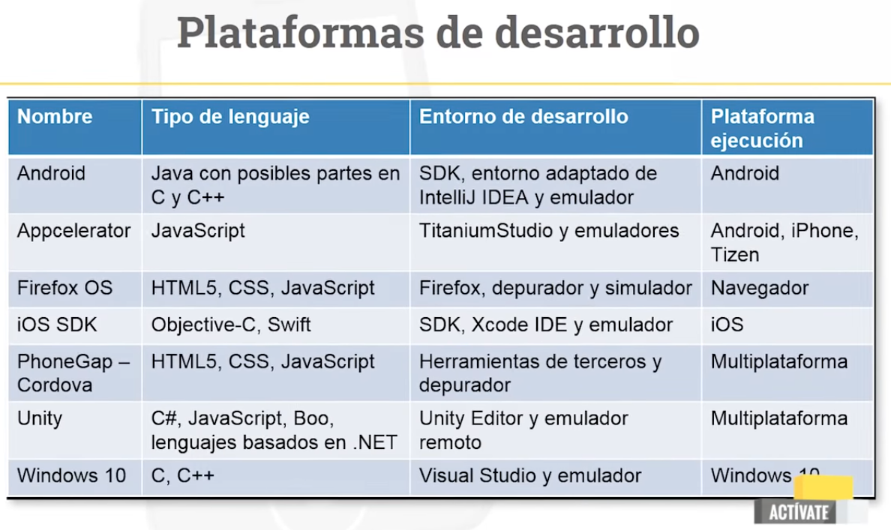
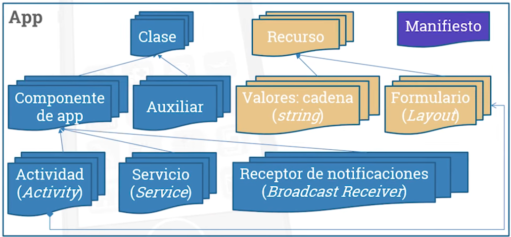
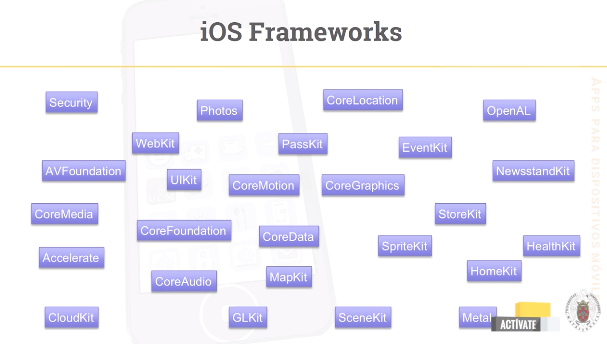
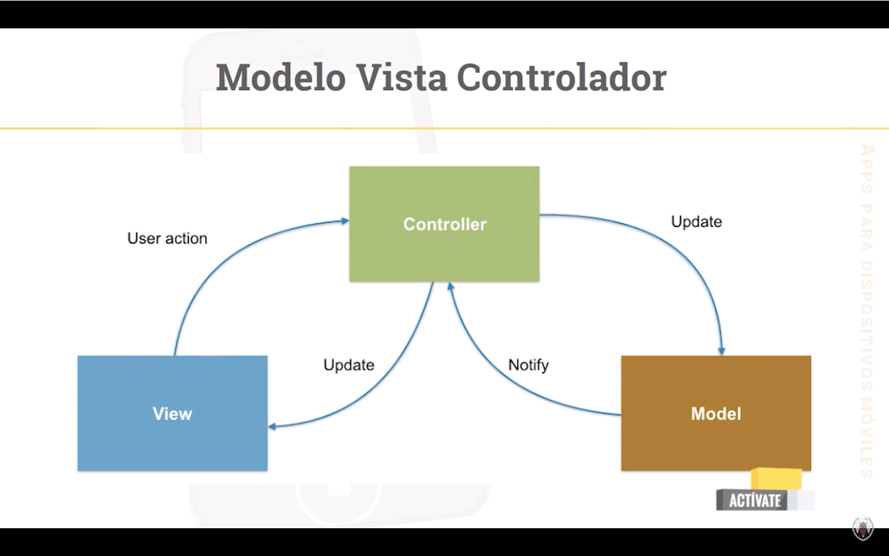

# Curso de Desarrollo de Apps Móviles - Activate

## Del nacimiento del teléfono móvil a las apps

### 1. Generaciones de la telefonía móvil

- **0G**: desde finales del siglo XIX.
    - Telefonía basada en radio.
    - Establecimientos específicos, navegación marítima, militares, coches, etc.
- **1G**: finales de los años 80.
    - Telefonía analógica.
    - Destinada a empresas.
    - Motorola desarrolla el primer dispositivo.
    - Aparece la itinerancia de datos.
- **2G**: años 90.
    - Telefonía digital basada en conmutación de circuitos.
    - Canal de comunicación extremo a extremo.
    - Se utiliza GSM.
        - Itinerancia internacional.
        - SMS para mensajes de texto cortos.
        - MMS para mensajes multimedia.
- **3G**: principios de los años 2000.
    - Comunitación basada en paquetes para transmitir datos.
    - Estándar UMTS: 384 kbps - 2Mbps.
- **4G**: finales de los años 2000 y 2010.
    - Solo utiliza conmutación de paquetes.
    - Desaparece la conmutación de circuitos para voz.
    - Mayor tasa de tranmisión.
    - Protocolos: WiMAX, LTE, LTEA.
- **5G**: estimada para comienzos del 2020. En desarrollo actualmente.
    - Mayores tasas de transferencia de datos: 10Mbits/segundo.
    - Soporta a un mayor número de conexiones simultáneas: 10000 usuarios.
    - Soporte a un mayor número de dispositivos registrados simultáneamente: 100000 dispositivos.
    - Eficiencia en el uso del espectro.
    - Escalabilidad.

### 2. La evolución de los smartphones

- Un dispositivo móvil es:
    - Recurso computacional.
    - Fácilmente transportable.
    - Tamaño reducido.
    - Interactivo.
    - Capacidad de comunicación.
    - Integra múltiples sensores y actuadores.
    - Caracteríticas variables entre dispositivos.
    - Tienen su propio SO.
        - Pueden ejecutar apps.

- Funcionalidad / capas
    - Terminal: implementada en el HW por el fabricante.
        - Ej. captar la señal de las antenas.
    - Sistema operativo: servicio básico
        - Convierte la señal en datos numéricos.
    - Aplicaciones: proporiona funcionalidad adicional sobre el SO.
        - Visualización de datos en un diagrama de barras.
    - Cada capa construye sobre los servicios de las anteriores.
        - Proporiona una visión uniforme.
    - La funcionalidad básica es limitada.
        - Terminal + sistema operativo.
    - Casi todos los usuarios la extienden con aplicaciones.

- Apps nativas vs multiplataformas
    - Nativas
        - Desventajas
            - Solo en un sistema operativo
        - Ventajas
            - Servicios avanzados como localización, acelerómetro, notificaciones, etc.
            - Velocidad de respuesta.
            - Sin límite de almacenamiento.
            - Dependencia reducida de la conectividad.
    - Multiplataformas
        - Desvenetajas
            - Peor experiencia de usaurio.
            - Requiere conectividad.
        - Ventajas
            - Más barato.
            - Múltiples sistemas operativos.
            - Basado frecuentemente en tecnologías webs.
            - Independiente de stores.
            - Sin instalación ni mantenimiento en el cliente.

    - Conclusiones
        - Los móviles y sus apps ya están presentes en todo el mundo.
        - El panorama no deja de evolucionar.
        - Gran fragmentación
            - Heterogeneidad de dispositivos.
            - Diferentes sistemas operativos.
            - Múltiples posibilidades de desarrollo.

### 3. El mercado de las apps

- Momentos de uso  
    - Estamos dispuestos a esperar solo en situaciones donde sabemos que los retrasos son comunes.
        - Ej: navegadores solicitando una página web.
        - Siempre que haya información de progreso.
- Tiempos de uso
    - El usuario suele tener poco tiempo para usar la aplicación.
    - Existe incertidumbe sobre la interacción.
    - Requerimos reacción inmediata.
- ¿Qué buscamos?
    - Usar una app supone dedicarle parte de nuestro valioso y escaso tiempo.
    - Exigentes con lo que nos ofrecen.
- Las apps deben ser:
    - Útiles.
    - Intuitivas.
    - Divertidas.
    - De uso frecuente.
- Monetización de las apps
    - La elección del modelo de monetización y de la plataforma es importante.
    - Depende del público objetivo y de la app.
    - El usuario de iOS gasta en apps 4 veces más que el de Android.
    - Buen análisis previo.
    - Causar muy buena impresión.

## Diseño y creación de apps

Para diseñar y crear una aplicación móvil es fundamental: conocer el proceso general que conlleva desarrollar una aplicación móvil, identificar el problema a resolver con una app, identificar nuestro público objetivo, analizar la competencia, comprender las necesidades por familias de dispositivos asociadas al desarrollo de apps para dispositivos móviles y saber los perfiles profesionales que suelen ser necesarios en los proyectos de desarrollo de apps.

### 1. Descubrir necesidades y problemas del mercado

- ¿Por qué alguien quiere comprar nuestra aplicación? Tipos:
    1. Sustituyen aplicaciones que antes se usaban en equipos de escritorio.
    2. Sustituyen elementos de la vida cotidiana como son la de lista para hacer la compra.
    3. Proporcionan funcionalidades nuevas.
- Tener claro que las apps móviles satisfances necesidades.
- Dos tipos de apps móviles:
    1. Las que nos han hablado bien de ellas, se descargan y se prueban.
    2. Sirven para gestionar el correo, redes sociales, mensajería, etc.
- Identificar nicho de mercado.
- Tener en cuenta la manera en que los usuarios van a usar la app.
- Identificar necesidades.
- Preguntar/consultar qué aplicaciones hacen falta o les gustaría tener a la gente.
- Analizar la competencia.
    - ¿Cómo puedo mejorarla?
    - ¿Cómo analizarla?
        - Buscar aplicaciones similares y descargarlas y buscar puntos fuertes y débiles.
        - Ver puntuaciones y comentarios.
        - Consultar a externos: qué tienen y qué necesitan.
- Actuar rápido en desarrollar la aplicación.
    - Tener cuidado con los detalles.

### 2. Necesidades específicas para el desarrollo en dispositivos móviles

- Tener en cuenta al desarrollar una app móvil:
    1. Características diferentes a las apps de PC.
    2. Capacidad de procesamiento.
    3. Memoria.
    4. Duración de batería.
    5. Pensar a largo plazo.
    6. Ver evolución de la aplicación.
    7. Escalabilidad.
    8. Características de pago.
    9. ¿Una sola plataforma o varias? ¿Distintas versiones de SO? ¿Adaptar app para cada SO o igual en todos?
    10. ¿Dispositivos a soportar? ¿Smartphones y/o tablets?
    11. Sensores a utilizar. ¿Y si no dispone de los sensores elegidos?
    12. Limitación del hardware.
    14. Conectividad. ¿Qué hacer cuándo no tiene datos/wifi?
    15. Posicionamiento.
    16. ¿Dispositivo real o emulador?
    17. Evolución.
        - Mantenimiento.
        - Actualizaciones.
        - Nuevas características.
        - Localización.
        - Escalabilidad.
    18. Publicación.
    19. Monetización.
        - Gratuita.
        - De pago.
        - In-app billing.
    20. Campañas de marketing para llegar a los usuarios final. 
        - Si el coste de la campaña de marketing es superior a los beneficios esperados, hay que buscar maneras distintas de distribuir la aplicación.

### 3. Planificación del desarrollo de apps

- ¿A qué nos enfrentamos?
    - Terreno casi desconocido.
        - Nuevos conceptos.
        - Nuevas interfaces.
        - Distinta interacción.
        - Distinta distribución.
        - Distintos usuarios.
        - Pocas reglas.
- Roles del equipo de desarrollo.
    - **Productor**: dirige el impulso del desarrollo y mitiga los riesgos.
    - **Diseñador**: refinan el concepto de la aplicación y el diseño funcional. Prueban los prototipos que se van lanzando.
    - **Programador**: personas con experiencia.
    - **Diseñadores gráficos**: desarrollar interfaces gráficas, botones, etc.
    - **QA**: prueba del producto en el mayor nº de equipos posibles.
    - **Localización**: traductores de la aplicación.
    - **Marketing**: posicionamiento de la app en el mercado.
- Proceso de desarrollo ágil:
    1. **Concepto**: documento no muy largo con las características principales de la aplicación. 
        - De 1 a 3 páginas.
        - Capturas de pantalla, maquetas y lista de características.
        - Documento de requisitos de marketing.
    2. **Diseño (Preproducción)**
        - Integridad en diseño.
        - Diagramas, maquetas, tablas, etc. así los desarrolladores sabrán que hacer con más detalles.
        - Planificación del desarrollo.
    3. **Producción**:
        - Los programadores terminan de construir la aplicación y comienza su funcionamiento correctamente.
        - Marcar hitos.
        - Finalizar características básicas primero.
        - Para cada hito: concepto, planificación, producción correcta.
    4. Testeo y postproducción
        - Aspecto gráfico.
        - Funcionamiento.
        - Utilización de recursos.
        - Optimización.
        - Puede llevar 1/3 del tiempo de desarrollo para probar la aplicación y comprobar que no se producen fallos.
    5. Lanzamiento
        - Fallos grandes:
            - Eliminar características para que la app funciona correctamente.
    6. Soporte
        - Mantenimiento y actualizaciones.
        - Planificar extensiones y mejoras.
            - Gráficos.
            - Compatibilidad con nuevos dispositivos.
            - Idiomas.
        - Pueden ser de todo tipo.
    7. Planificación del desarrollo
        - Aplicar la regla de los tres tercios:
            1. Planificación y diseño.
            2. Interfaz, diseño gráfico y codificación.
            3. Testeo de la aplicación.
        - Estimar tiempo
            - Ecuación: sumar el tiempo mejor + tiempo peor + 4 veces el tiempo de desarrollo más probable dividido entre seis.
                - **Te = (Tm + Tp + 4*Tmp) / 6**
            - Variante, aplicada a videojuegos: 
                - **Te = (Tm + 3*Tp + 2*Tmp) / 6**
            - Tener en cuenta riesgos y que puede haber retrasos.

## Plataformas de desarrollo - Android

### 1. Android: introducción.

- Plataforma más popupar para apps móviles.
- Baja inversión inicial: todo gratuito o de bajo coste.
- Distinciones
    - Sistema operativo: basado en el núcleo de Linux (kernel).
    - Entorno de ejecución.
    - Entorno de desarrollo: Android estudio.
        - Kit estándar de desarrollo: SDK 
        - Entorno de desarrollo: IDE
- Cada versión de Android proporciona un nuevo nivel de la API.
    - Android 1.0 - API 1
    - Android 1.5 - API 3
    - Android 3 - API 11
    - Etc.
- Fragmentación.
- Arquitectura de capas.
    - Proveedores de dispositivos: trabajan a nivel de hardware
    - Consorocio liderado por Google: softwarte
    - Usuarios: a nivel de apps.
- Licencias: garantizan que se pueden conocer y modificar todas las partes software de la plataforma.

### 2. Android: recursos.

- Android Studio: entorno de desarrollo (IDE).
- Componentes básicos
    - Kit estándar de desarrollo: SDK. Entorno de ejecución, librerías, emuladores, ejemplos de código fuente, etc.
        - SDK manager: herramienta para gestionar los componentes (librerías) instalados con el SDK. Se puede instalar una determinada versión de SO Android.
        - Incorpora herramientas necesarias para la gestión de los emuladores (AVD).
            - Se realizan las primeras pruebas de las APPs con estos entornos virtuales.
    - Android Studio IDE: entorno de desarrollo.
        - Se pueden diseñar las interfaces gráficas arrastrando componentes sobre un lienzo.
    - Documentación
        - Android Developers.
            - **Distribute**: gestores interesados en distribuir su app.
            - **Desing**: diseñadores gráficos centrados en la estructura y programación de apps.
            - **Develop**: desarroladores centradso en la estructura y programación de apps.

### 3. Android: elementos de una app.

- Estructura básica:
    - Clases java: componentes de la app y predefinidas en la plataforma.
        - Actividades
            - Interfaz de usuario.
            - Tareas cortas.
        - Servicios
            - Tareas largas.
            - Sin interfaz de usuario.
        - Receptores de notificaciones
            - Tratan avisos globales del sistema.
            - No tienen interfaz, pero pueden usar la barra de notificaciones.
    - Clases auxiliares
        - Creadas desde cero.
        - Pueden utilizar elementos de la librería, pero no son modificaciones de ellos.
    - Recursos: elementos estáticos (no describen funcionalidad): diseño de un formulario, imagen, sonido, secuencia de palabras, etc. Estos se usan desde las clases.
        - Se utilizan por los asistentes automatizados.
        - Descripción de la parte de la interfaz: layouts.
        - Menús.
        - Apariencia de elementos de interfaz: style.
        - Colores: color.
        - Gráficos como mapa de bits o XML: drawable.
        - Texto: string, array o plurals.
        - XML.
    - Manifiesto: describen diferentes permisos y requisitos de la app:
        - Versión mínima de la plataforma Android para que funcione.
        - Que la app necesita acceder a la agenda, etc.
        - AndroidManifest.xml
            - Nombre completo de la app.
            - Componentes que forman parte de la app.
            - Permisos (acceso agenda, micrófono, etc).
            - Niveles de la API requerido.

### 4. Android: desarrollo de una app Android

[Instalación de Android Studio](https://developer.android.com/studio/install?hl=es)

## Plataformas de desarrollo - iOS

### 1. Introducción

- Sistema operativo de los dispositivos móviles de Apple. 
- No se puede ejecutar en dispositivos de otras compañías. 
- Apareció en 2007 con el primer iPhone.
- Con OSx tienen en común herramientas y utilidades.
- iOS Human Interface Guidelines: dan consejos de como debe funcionar la aplicación.
- Guía de revisión de aplicaciones: todo lo que NO debemos hacer si se busca que aprueben la aplicación en el App Store.

### 2. iOS: recursos para el desarrollo

- Se necesita un ordenador de Apple para desarrollar aplicaciones para iOS.
- Xcode: IDE para desarrollar de las apps para iOS.
    - Se necesita un Apple ID.
    - Si se quiere subir una APP hay que adquirir una cuenta de desarrollador (99$ anuales).
- Se utiliza Objective-C y Swift.

**Capas de iOS**
- Siempre se recomienda empezar a programar utilizando la capa más alta.
    - Se baja a niveles inferiores cuando no se puede realizar desde la capa superior.
    -  Cada capa se compone de diferentes frameworks.
        - **UIKit**: interfaz de usuario.
        - **CoreData**: base de datos.
        - **CoreGraphics**: dibujos y gráficos.
        - **AVFoundation**: grabación, edición y reprodución de audio y vídeo. 
        - **GLKit**: ayuda en la integración de 3D con el motor OpenGL.
        - **MapKit**: mostrar mapas.
        - **SpriteKit**: dev de juegos 2D.
        - **StoreKit**: gestionar in-app purchases.
        - Etc.

- Capas
    - Cocoa Touch
    - Media
    - Core Services
    - Core OS

- Estructura: modelo-vista-controlador

- Componente básico: View controller
    - Representa cada una de las pantallas de la aplicación.
    - Se encarga de la gestión de las diferentes vistas de la pantalla.
    - También de la entrada del usuario a través de tabs o gestos sobre la interfaz.
    - Se encarga también de la comunicación con el modelo y de la actualización de las vistas cuando corresponda.
